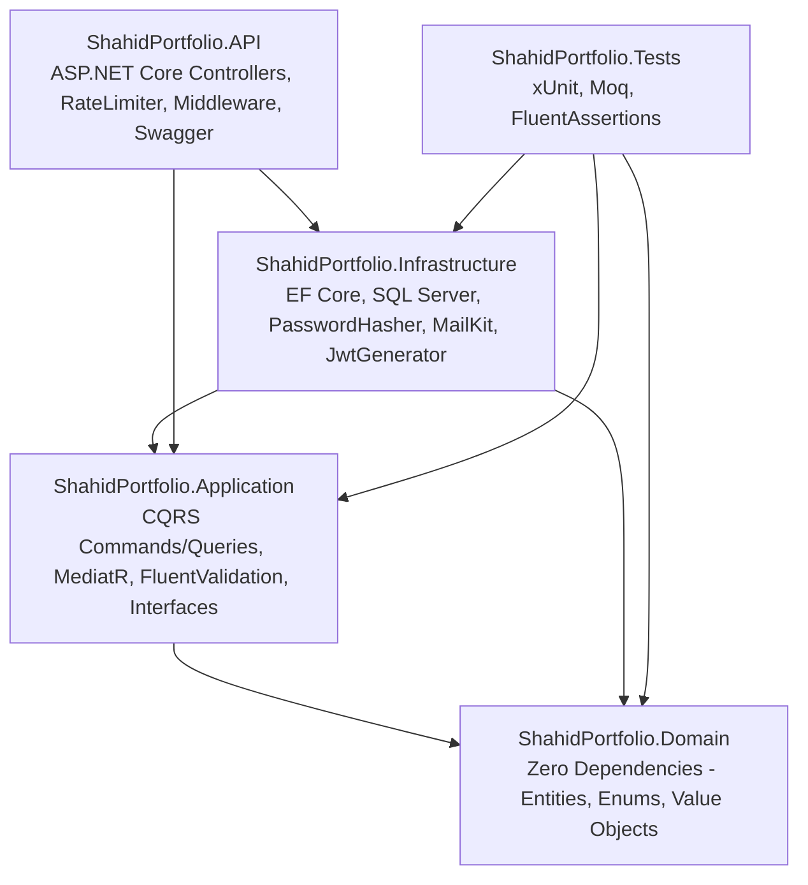

# Shahid Hussain - Developer Portfolio (Backend)

[](https://github.com/shahid08569/shahidPorfolioBackend/actions/workflows/backend-ci.yml)
[](https://dotnet.microsoft.com/)
[](https://learn.microsoft.com/en-us/dotnet/csharp/)
[](https://www.microsoft.com/sql-server)
[](https://opensource.org/licenses/MIT)

> Enterprise Clean Architecture Web API powered by .NET 10, CQRS with MediatR, FluentValidation pipeline behaviors, EF Core, and JWT Security.

---

## 🏛️ Architecture Overview

The solution adheres strictly to **Clean Architecture** (Onion Architecture) with isolated layers:



### Key Architectural Highlights

- **CQRS Pattern:** Strict separation of mutations (Commands) and reads (Queries) using MediatR.
- **Pipeline Behaviors:** Centralized validation via `ValidationBehavior<TRequest, TResponse>` that intercepts commands and validates rules before handler execution.
- **Pure Entities:** Clean domain model with EF Core Fluent API configurations (`IEntityTypeConfiguration<T>`) avoiding data annotations pollution.
- **Enterprise Security:** Salted PBKDF2 with SHA-512 hashing (100,000 iterations), JWT Bearer authentication with sliding refresh tokens.
- **Resilient Email Dispatcher:** `MailKit` implementation with fallback logger mode when SMTP credentials are not configured.
- **Anti-Spam Defense:** Fixed-window rate limiting (max 3 submissions / 10 mins / IP) and honeypot field evaluation.

---

## 📂 Solution Structure

```
shahidPorfolioBackend/
├── src/
│   ├── ShahidPortfolio.Domain/           # Core enterprise domain entities and enums
│   ├── ShahidPortfolio.Application/      # CQRS features, pipeline behaviors, DTOs, interfaces
│   ├── ShahidPortfolio.Infrastructure/   # EF Core DbContext, migrations, MailKit, password hasher
│   └── ShahidPortfolio.API/              # Controllers, middleware, rate limiting, Swagger
├── tests/
│   └── ShahidPortfolio.Tests/            # xUnit tests with FluentAssertions and Moq
└── ShahidPortfolio.slnx                  # Solution file
```

---

## 🚀 Getting Started

### Prerequisites

- [.NET 10 SDK](https://dotnet.microsoft.com/download)
- [Microsoft SQL Server Express or LocalDB](https://www.microsoft.com/sql-server/sql-server-downloads)

### Database Configuration

Update the connection string in `src/ShahidPortfolio.API/appsettings.json` if required:

```json
"ConnectionStrings": {
  "DefaultConnection": "Server=.\\SQLEXPRESS;Database=ShahidPortfolioDb;Trusted_Connection=True;TrustServerCertificate=True;MultipleActiveResultSets=true;"
}
```

*Note: Migrations apply and initial seed data is inserted automatically upon startup.*

### Running the API

```bash
# Clone the repository
git clone https://github.com/shahid08569/shahidPorfolioBackend.git
cd shahidPorfolioBackend

# Restore dependencies
dotnet restore

# Run the API project
dotnet run --project src/ShahidPortfolio.API
```

API will be available at `http://localhost:5272` (Swagger UI: `http://localhost:5272/swagger`).

### Running Tests

```bash
dotnet test
```

---

## 📡 API Endpoints

### Public Endpoints
- `GET /api/v1/settings/public` - Site bio, title, availability status, CV link, active social links.
- `GET /api/v1/projects` - Filterable projects with `isFeatured` and `tag` queries.
- `GET /api/v1/projects/{slug}` - Deep-dive case study with problem/solution/architecture breakdown.
- `GET /api/v1/skills` - Grouped skills matrix (Frontend, Backend, Database, DevOps).
- `GET /api/v1/experiences/timeline` - Career history milestones and academic credentials.
- `GET /api/v1/testimonials` - Endorsements and recommendations.
- `GET /api/v1/blog` - Published technical articles.
- `GET /api/v1/blog/{slug}` - Full article with markdown body.
- `POST /api/v1/contact` - Rate-limited contact message submission with anti-spam honeypot defense.

### Admin & CMS Endpoints (`[Authorize]`)
- `POST /api/v1/auth/login` - Admin authentication returning JWT access & refresh tokens.
- `POST /api/v1/auth/refresh` - Refresh token rotation.
- `GET /api/v1/auth/me` - Authenticated admin profile claim.
- `POST /api/v1/admin/projects` - Create project.
- `PUT /api/v1/admin/projects/{id}` - Update project.
- `DELETE /api/v1/admin/projects/{id}` - Delete project.
- `POST /api/v1/admin/skills` - Add skill.
- `DELETE /api/v1/admin/skills/{id}` - Remove skill.
- `GET /api/v1/admin/messages` - Review contact inquiries.
- `PUT /api/v1/admin/messages/{id}/read` - Mark message as read.
- `DELETE /api/v1/admin/messages/{id}` - Delete inquiry.
- `PUT /api/v1/admin/settings` - Update bio, title, location, status.
- `POST /api/v1/media/upload` - Upload media file (`.png`, `.jpg`, `.webp`, `.pdf`).
- `POST /api/v1/media/upload-cv` - Upload and link new CV PDF.

---

## 🔐 Default Admin Account (Seeded)

- **Email:** `shahidhussaain08569@gmail.com`
- **Password:** `Admin@Portfolio2026!`

---

## 📄 License

This project is licensed under the MIT License - see the [LICENSE](LICENSE) file for details.
